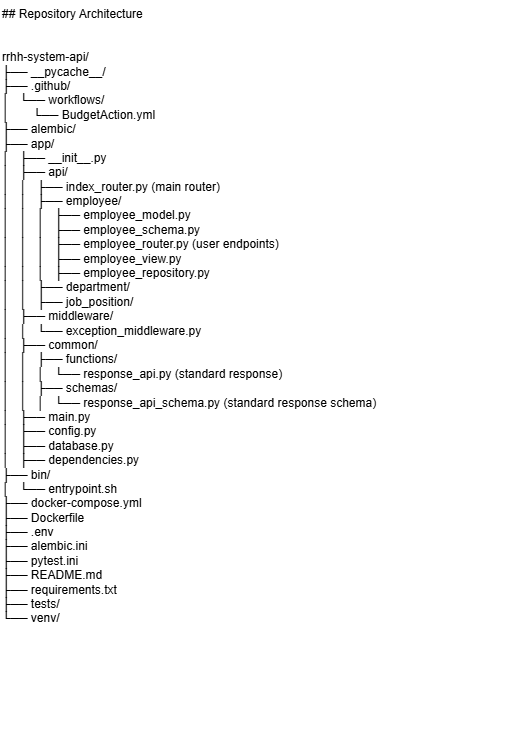

# RRHH System test

This is a Backend repository made on top of Python and Flask. 

This is a personal project made to showcase my skills with python as backend, is an open source code and  aim of the entire project is to create a "rrhh system app" to manage your organization

## Installation

To run this project execute the following steps

Step 1: Clone the Repository

    git clone ["this repository link"]

Step 2: Create a Virtual Environment

    python -m venv venv

Step 3: Activate a Virtual Environment

on Windows:

    venv\Scripts\activate

on Linux/MacOs:

    source venv/bin/activate

Step 4: Install Dependencies

    pip install -r requirements.txt

Step 5: Run the Application

Move to the app/ directory:
    
    cd app/

Start the FastAPI development server:

    python main.py
    
    
## Running Unit Tests

To ensure that everything is working correctly, you can run the unit tests that have been set up.

Run All Tests
To run all the tests:

    pytest tests

Run a Single Test
To run a single test, for example, test_users.py:

    pytest tests/test_users.py

## Evironment Variables

DB CREDENTIALS

    USERNAME_DB=your_username
    PASSWORD_DB=your_password
    HOST_DB=your_host
    PORT_DB=your_port
    DATABASE_NAME=your_db_name

## Repository Architecture

## Repository Architecture

## 🚀 About Me
I'm a Python full stack developer... profiency using backend tools such as Django/ FastAPI, SQL and NoSQL Databases and AWS cloud compute.

Frontend skills all related to react ecosystem... React.js,Next.js, React Native, Redux and Zustand. 
